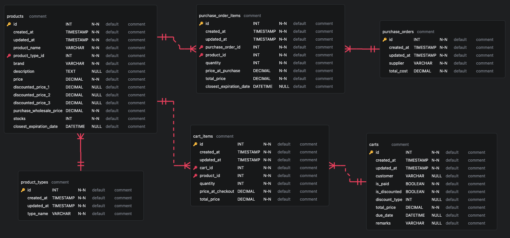

## Overview
**POS-Lite** is a lite version of a point of sale system with inventory tracking features, designed with small businesses in mind.

The goal is to make this usable on the browser as a web app as well as on mobile or tablet devices as a native app, and for database information to sync across multiple devices.

## Features
  - [x] Adding and editing products
  - [x] Quick lookup of product price and availability
  - [ ] List and store information about customer purchases
    - note: no information (outside of the optional name) is stored about customers
  - [ ] Tracking available stocks of products
  - [ ] Notification for possible expiry of a batch of products

## Technologies
  - PHP (Laravel)
  - Vue with TypeScript
  - SQLite (to be PostgreSQL)

## Usage
- TBA

## Media
### Demo
- TBA

### ERD


## Resources
- TBA

## Setup Guide
To set up the project locally, ensure that you have the following installed on your device:
*	PHP (version 8.x or higher)
*	Composer (latest version)
*	Node.js (LTS version recommended)
*	NPM or Yarn
*	MySQL or another database supported by Laravel
*	Git (to clone the repository)

## Setup
1. Clone the repository
```
git clone https://github.com/ahliesantiago/pos-lite.git
cd pos-lite
```
2. Run `composer install` to install the dependencies.
3. Run `npm install` (or `yarn install`) to install the dependencies.
4. Run `cp .env.example .env` to copy the `.env.example` file to `.env` and configure the required settings.
5. Update the database settings in the `.env` file to match your database configuration.
6. Run the following commands to generate a unique application key, migrate the database, and seed the data:
```
php artisan key:generate
php artisan migrate
php artisan db:seed
```
7. Run `php artisan serve` to start the development server.
8. Run `npm run dev` (or `yarn dev`) to start the development server.