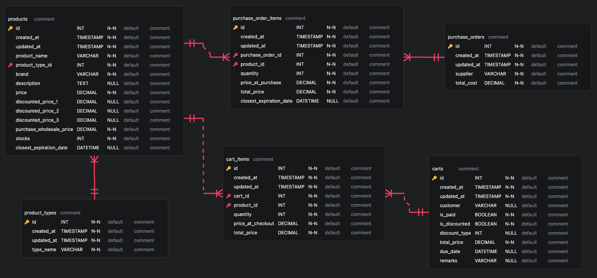

## Overview
**POS-Lite** is a lite version of a point of sale system with inventory tracking features, designed with small businesses in mind.

The goal is to make this usable on the browser as a web app as well as on mobile or tablet devices as a native app, and for database information to sync across multiple devices.

## Features
  - Adding and editing products
  - Quick lookup of product price and availability
  - List and store information about customer purchases
    - note: no information is stored about customers
  - Tracking available stocks of products
  - Notification for possible expiry of a batch of products

## Technologies
  - PHP (Laravel)
  - Vue with TypeScript
  - SQLite (to be PostgreSQL)

## Usage
- TBA

## Media
### Demo
- TBA

### ERD

## Resources
- TBA
